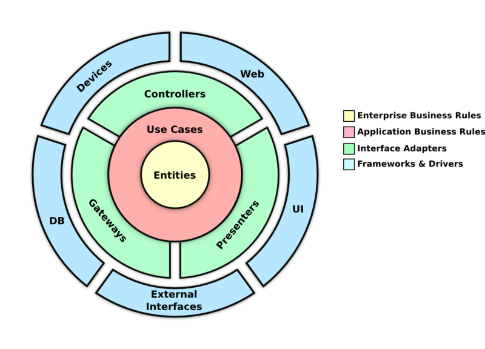

# ADR-1: Clean Architecture

## Status
Rejected

## Context
We need a maintainable, testable, and decoupled backend structure that reduces dependency on a specific framework and produces durable code.

## Decision
Adopt Clean Architecture: separate domain, application, and adapter layers.

## Consequences
- Business logic is isolated from infrastructure.
- Easier testing and future refactoring.
- Added initial complexity to potentially temporary code.
