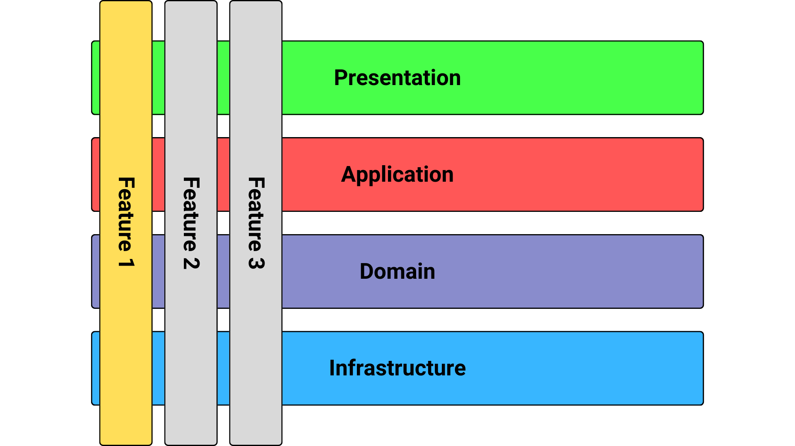

# ADR-2: Vertical Slicing

## Status
Accepted

## Context
Feature work should be modular and independently deployable. As patterns emerge between features, it should be easy to refactor towards reusable code that only contains domain logic and not application or business logic. 

## Decision
Organize code into vertical feature slices (e.g., save_submission, patient_analytics), each with its own models, use cases, and adapters. This approach is an example of vertical slicing, which improves modularity, testability, and maintainability by keeping all related logic together.

Each vertical slice or feature should be self-contained and functional end-to-end.

## Consequences
- Features are self-contained and scalable.
- Teams can work in parallel with minimal conflicts.
