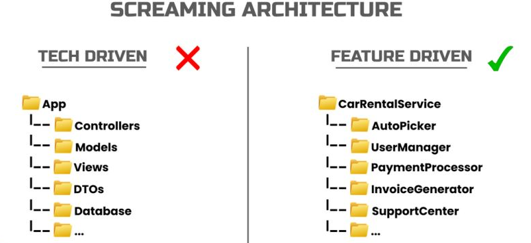

# ADR-3: Screaming Architecture

## Status
Accepted

## Context
Directory and file names reflect business domains and features, not technical patterns.

## Decision
Screaming Architecture is a design principle that emphasizes making the intent and domain of a system obvious from its structure and naming. The project structure should "scream" its purpose, rather than technical details or frameworks.

This approach is compatible with Clean Architecture (see [[ADR-1]]) and vertical slicing (see [[ADR-2]]), as it encourages clear boundaries and feature-oriented organization.

## Consequences
- Newcomers quickly understand project purpose.
- Reduces cognitive load for navigation.
