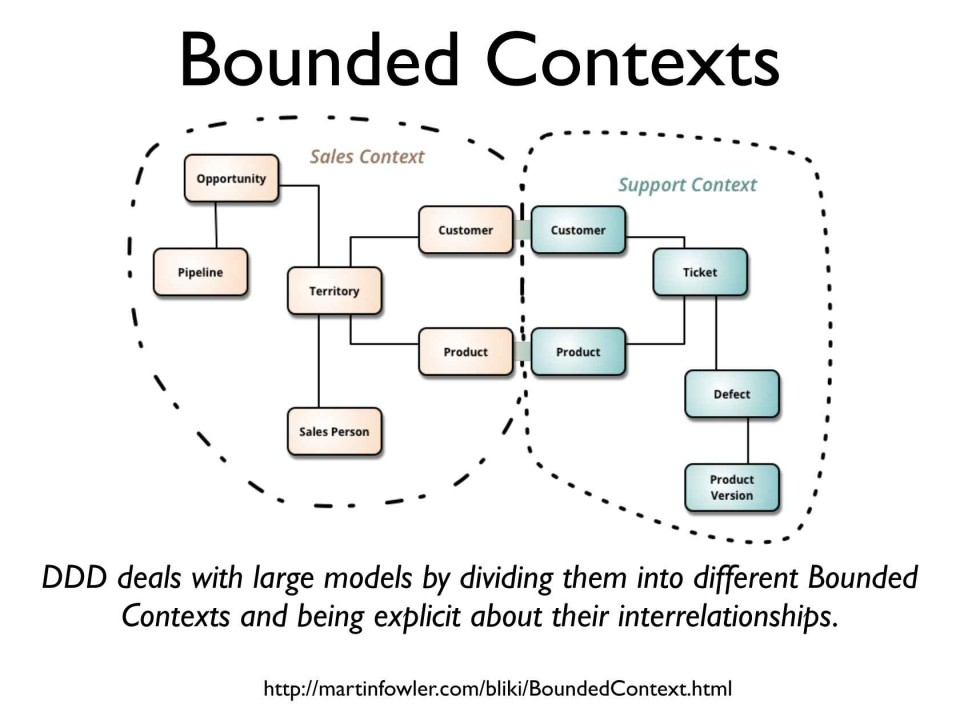
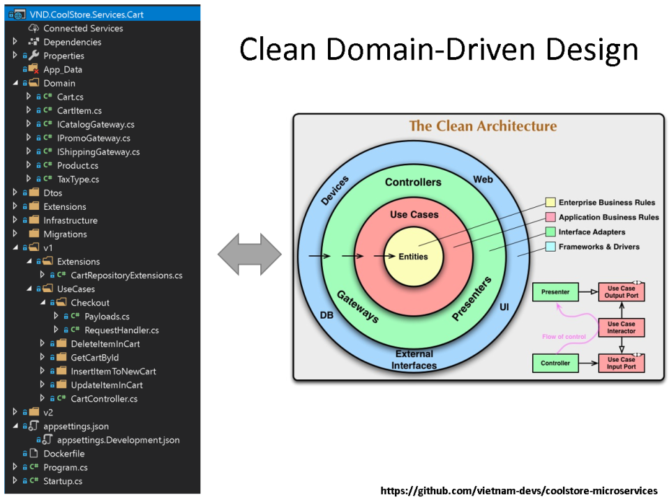
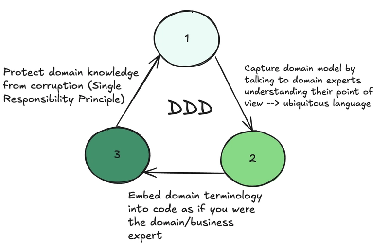

# ADR-5: Domain Driven Design (DDD)

## Status
Proposed

## Context
We want to model our core business logic using patterns that reflect real-world concepts and ensure a robust, maintainable, and expressive codebase.

## Decision
Adopt Domain Driven Design (DDD) principles for our core logic, including the use of entities, value objects, repositories, aggregates, and bounded contexts.

## Consequences
- The following DDD patterns are used:
  - **Entities**: Business objects with identity (e.g., Submission, Patient, Answer, Question, Form as Python dataclasses).
  - **Value Objects**: Immutable, equality-based objects (e.g., deterministically generated IDs).
  - **Repositories**: Abstract interfaces for persistence (e.g., SubmissionRepository).
  - **Aggregates**: Logical groupings of entities and value objects (e.g., a Submission aggregate with Answers).
  - **Bounded Contexts**: Each feature slice acts as a bounded context (e.g., save_submission, patient_analytics).
  - **Gateways**: Infrastructure implementations for persistence (e.g., MySQL gateways).
- Compatible with Clean Architecture pattern (see [[ADR-1]]): DDD patterns are implemented in the domain and application layers, separate from infrastructure.

  

- Compatible with Vertical Slicing pattern (see [[ADR-2]]): Each slice contains its own domain model and logic, supporting modularity and independent evolution.

  

- Compatible with Screaming Architecture pattern (see [[ADR-3]]): Feature and domain boundaries are clear and explicit in the project structure.
- Added initial complexity to potentially temporary code, however, Entities were kept.
