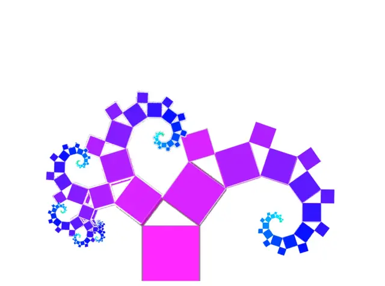
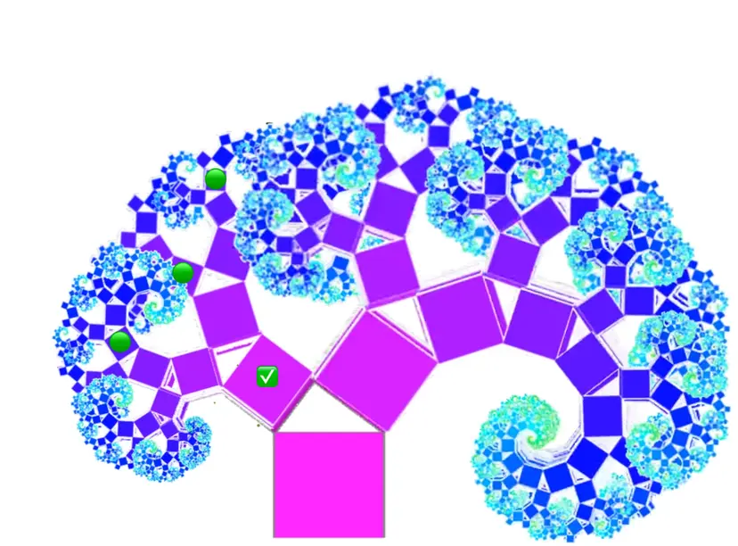

# ADR-6: Fractal File Structure

## Status
Proposed

## Context
While following various refactoring techniques and in alignment with our architectural patterns, it often makes sense to extract shared code into a "Core" folder. This folder does not always make sense at a global level, but rather at a module or feature slice level.

Conversely, resources such as templates, assets, or configuration files may start global, but it can make sense to package them into a module, which may later become a reusable functional slice.

The concept of a "fractal project structure" is well outlined in this article: [File structuring using fractal trees: Scalable code organizing for large projects and monorepos](https://hash.dev/blog/file-structuring)

This approach is consistent with the way frameworks like Symfony have evolved and is highly compatible with Vertical Slicing pattern (see [[ADR-2]]), Screaming Architecture pattern (see [[ADR-3]]), and Clean Architecture pattern (see [[ADR-1]]) as adopted in this project.

## Decision
Adopt and document a set of simple rules to manage emerging complexity as code and architecture evolve. Each feature, slice, or module contains the same predictable set of folders and files (e.g., domain, application, adapters, tests), recursively, at every level of the project.

## Consequences
1. Developers can easily navigate and scale the codebase as it grows.
2. Onboarding is faster, as patterns are consistent everywhere.
3. Tests are easy to locate: while the root `/tests` folder is the best place to start, as code evolves, it makes sense to bring tests closer to a core, module, or slice. The benefits of Screaming Architecture pattern (see [[ADR-3]]) emerge organically.
4. Supports Clean Architecture pattern (see [[ADR-1]]), Vertical Slicing pattern (see [[ADR-2]]), and Screaming Architecture pattern (see [[ADR-3]]) by making boundaries and responsibilities explicit at every level.
5. Enables modularization and refactoring without breaking conventions.
